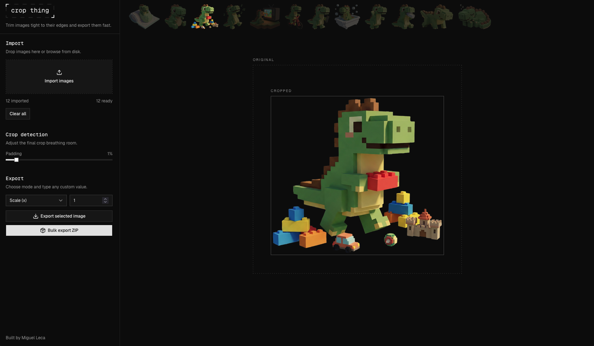

# Crop Thing

Trim images tight to their edges and export them fast.

Crop Thing is a lightweight web app for importing one or many images, automatically trimming them to their real content bounds, previewing the result, and exporting either a single cropped image or a bulk ZIP.

## How It Works

- Import one image or a batch of images
- Review each crop in the preview workspace
- Export the selected image or bulk export everything as a ZIP

## App Preview

## Built By

Built by Miguel Leca.
